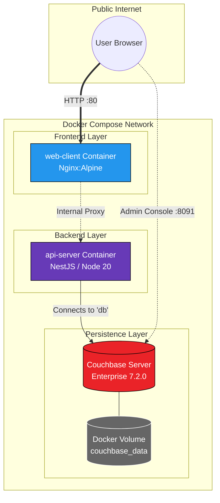

# Hilton Restaurant Reservation System

A high-performance, full-stack monorepo application designed for luxury hospitality management. This system allows guests to book tables and Hilton employees to manage reservations in real-time.

## 🏗️ Architecture & Tech Stack

This project follows **Clean Architecture** principles to ensure separation of concerns, scalability, and maintainability.

* **Monorepo Management:** [Nx](https://nx.dev) (Shared libraries for types and data access)
* **Backend:** [NestJS](https://nestjs.com) (Node.js framework)
    * **API Layers:** Hybrid REST (for Auth) & GraphQL (for Business Logic)
    * **Security:** Passport.js with JWT & Bcrypt password hashing
* **Frontend:** [React](https://reactjs.org) with [Vite](https://vitejs.dev)
    * **State & API:** [Apollo Client](https://www.apollographql.com/docs/react/)
    * **Forms:** React Hook Form with Class-Validator integration
* **Database:** [Couchbase](https://www.couchbase.com) (NoSQL)
    * **Querying:** SQL++ (N1QL) for complex filtering and reporting

## 🚀 Getting Started

### 1. Infrastructure (Docker)
Ensure you have Couchbase running. You can use the official Docker image:
```bash
docker run -d --name db -p 8091-8096:8091-8096 -p 11210:11210 couchbase
```

### 2. Installation

Install dependencies from the workspace root:

```bash
pnpm install
```

### 3. Running the Apps

Launch both the API and the Web Client simultaneously:

```bash
# Terminal 1: API Server
npx nx serve api-server

# Terminal 2: React Frontend
npx nx serve web-client
```

## 🛠️ Key Functionalities

### 👤 Guest Experience
- **Secure Auth**: JWT-based login and registration.
- **Dynamic Booking**: Real-time table requests with automatic validation (Date/Time, Table Size).
- **Personalized View**: Guests are restricted to the booking interface only.

### 💼 Employee Management (Staff Portal)
- **RBAC Protection**: The dashboard is locked behind a RolesGuard.
- **Status Workflow**: Staff can transition bookings through: Requested → Approved → Completed/Cancelled.
- **Instant Filtering**: Filter the entire day's bookings by status without page reloads.

### 📁Workspace Structure
- **`apps/`**: Contains the two main applications:
  - **`api-server/`**: The backend server built with NestJS, using both GraphQL and REST controllers.
  - **`web-client/`**: The frontend application built with React, using Vite for bundling and Apollo Client for GraphQL integration.

- **`libs/`**: Contains shared libraries across the applications:
  - **`data-access/`**: A shared library that includes models, repositories, and enums used by both applications.

- **`nx.json`**: The configuration file for the Nx monorepo.

- **`package.json`**: The unified file that manages dependencies across the entire monorepo.

## 🔒 Security Measures

- **N1QL Injection Prevention**: All database interactions use parameterized queries.
- **Client-Side Guards**: React Router ProtectedRoute prevents unauthorized URL access.
- **Server-Side Guards**: NestJS GqlAuthGuard and RolesGuard enforce permissions at the API level.
- **Data Integrity**: class-validator ensures only "clean" data hits the database.

## 🏗️ Deployment Topology

The following diagram illustrates the containerized architecture and network flow of the Hilton Reservation System.

